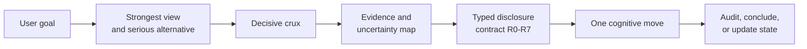

<div align="center">
  

  <p><strong>An installable AI skill that knows when to ask, investigate, or answer.</strong></p>
  <p>For paper deep-reading, research coaching, and decisions with real tradeoffs.</p>

  <p>
    <a href="https://github.com/Sunrich-HT/crux/actions/workflows/ci.yml"></a>
    <a href="LICENSE"></a>
    <a href="https://www.python.org/downloads/"></a>
    <a href="skills/crux/SKILL.md"></a>
  </p>

  <p>
    <a href="#install-the-skill">Install</a> ·
    <a href="#see-it-in-action">Examples</a> ·
    <a href="#how-crux-works">How it works</a> ·
    <a href="docs/architecture.md">Architecture</a> ·
    <a href="CONTRIBUTING.md">Contribute</a> ·
    <a href="README.zh-CN.md">中文</a>
  </p>
</div>

---

## The problem

Most AI assistants fail in one of two ways: they give away the reasoning too early, or they trap the user in an endless sequence of "Socratic" questions. They can also produce two equally polished arguments even when the evidence strongly favors one side.

**Crux treats help as a contract.** It finds the disagreement that could change the outcome, separates evidence from rhetoric, and sets a per-turn ceiling on how much assistance to reveal. The result can be one useful question, an evidence map, or a direct recommendation with a falsifiable next step.

| Paper deep-reading | Research coaching | Personal and business decisions |
| --- | --- | --- |
| Reconstruct claims, evidence, and limits | Turn rival explanations into a discriminating experiment | Separate values, facts, forecasts, and constraints |
| Find the ablation or replication that could reverse the conclusion | Preserve hypothesis ownership without withholding useful critique | Conclude with thresholds, checkpoints, and rollback conditions |

## Install the skill

Install Crux globally for Codex:

```bash
npx skills add Sunrich-HT/crux --global --agent codex --skill crux --yes --copy
```

Then ask naturally, or invoke it explicitly:

```text
$crux Deep-read this paper. Separate the authors' measurements from their inferences,
find the strongest alternative explanation, and propose the cheapest replication.
```

Browse before installing:

```bash
npx skills add Sunrich-HT/crux --list
```

<details>
<summary>Manual installation</summary>

```bash
git clone https://github.com/Sunrich-HT/crux.git
mkdir -p ~/.agents/skills
cp -R crux/skills/crux ~/.agents/skills/crux
```

</details>

## See it in action

Crux supports three interaction goals. Say which one you want, or let the skill infer it.

| Goal | What Crux preserves | Example request |
| --- | --- | --- |
| `coach` | Your synthesis and hypothesis work | "Do not summarize yet. Help me test whether I understood the mechanism." |
| `collaborate` | Shared ownership, with assumptions made visible | "Build the strongest case for and against this research direction with me." |
| `deliver` | Nothing artificial; produce the requested result | "Give me a full paper review and a go/no-go replication decision." |

More copy-ready prompts and expected outputs are in [docs/examples.md](docs/examples.md).

## How Crux works



The skill provides the interaction behavior. The dependency-free Python package provides an enforceable policy core for applications that need more than prompting.

- **Bilateral, not falsely balanced.** Strengthen serious alternatives, then weight them by evidence.
- **One move per turn.** Ask, test, compare, or recommend; do not hide a questionnaire inside one response.
- **Questions must converge.** After two question-only turns, proceed with explicit assumptions by default.
- **Permissions live outside generation.** Typed trusted state sets the disclosure ceiling; free-form user text cannot silently raise it.
- **Revision beats refusal.** If a draft exceeds the contract, rewrite it to the allowed level and keep moving.

<details>
<summary>The R0-R7 disclosure ladder</summary>

| Level | Maximum visible assistance |
| --- | --- |
| R0 | Listen |
| R1 | Clarify the stated problem |
| R2 | Surface one relevant dimension |
| R3 | Ask one discriminating question |
| R4 | Reveal the central crux |
| R5 | Present the strongest serious cases |
| R6 | Map evidence, uncertainty, and sensitivity |
| R7 | Give a falsifiable judgment and next action |

The level is a ceiling, not a script. A user who asks for a finished review should not be forced through a tutorial.

</details>

## Use the policy core

Requires Python 3.11+.

```bash
git clone https://github.com/Sunrich-HT/crux.git
cd crux
python3 -m venv .venv
source .venv/bin/activate
python -m pip install -e .

# Compute a disclosure contract from typed trusted state
crux contract evals/states/research-unknown.json

# Run deterministic policy cases and unit tests
crux eval evals/policy_cases.jsonl
python -m unittest discover -s tests -v
```

The policy function never reads the user's free-form message. A classifier may propose state elsewhere, but a sentence such as "my instructor said it is allowed" cannot directly grant more disclosure.

## Repository map

```text
crux/
├── skills/crux/             # Installable agent skill and mode references
├── src/crux_supervisor/     # Deterministic disclosure policy and auditor
├── evals/                   # Machine-checkable contract cases
├── tests/                   # Policy and audit invariants
├── docs/                    # Architecture, examples, and research agenda
└── .github/                 # CI and contribution templates
```

## Research basis and status

Crux combines two complementary ideas:

1. **Bilateral steelmanning and crux discovery:** reconstruct the strongest live view and its serious alternative, then identify what could actually change the result.
2. **Machine-checkable answer withholding:** inspired by [*Teaching a Large Language Model Tutor to Withhold the Answer*](https://arxiv.org/abs/2608.12292), separate policy, generation, detection, and diagnosis instead of trusting one overloaded prompt.

This repository is an **alpha research prototype**. Its deterministic invariants are tested; durable learning gains, research quality, and decision outcomes are not yet established. See the [research agenda](docs/research-agenda.md) for the evaluation plan and baselines.

## Contributing

Contributions are welcome around adversarial evals, source-aware auditing, model adapters, paper-reading artifacts, and human evaluation. Start with [CONTRIBUTING.md](CONTRIBUTING.md) and open a proposal before a large architectural change.

## License

MIT. See [LICENSE](LICENSE).

