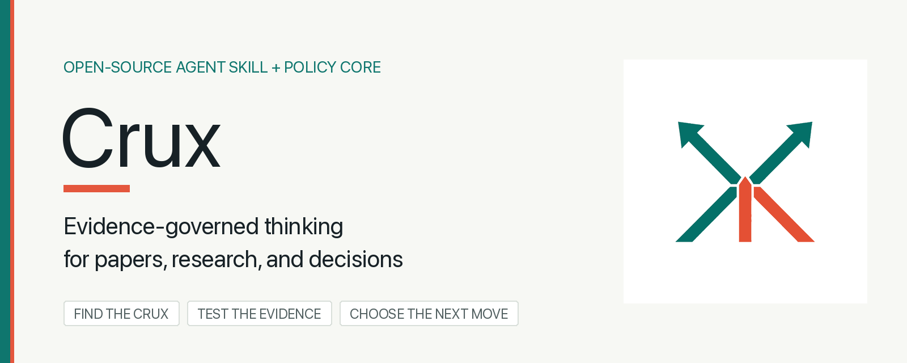
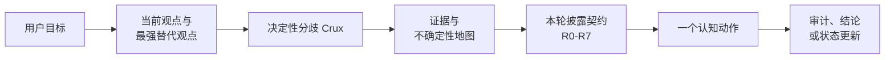

<div align="center">
  

  <p><strong>一个知道何时追问、何时查证、何时直接给结论的 AI Skill。</strong></p>
  <p>适用于论文精读、科研辅导，以及存在真实取舍的个人与商业决策。</p>

  <p>
    <a href="https://github.com/Sunrich-HT/crux/actions/workflows/ci.yml"></a>
    <a href="LICENSE"></a>
    <a href="skills/crux/SKILL.md"></a>
  </p>

  <p>
    <a href="#安装-skill">安装</a> ·
    <a href="#一个亲自跑通的例子">实测案例</a> ·
    <a href="#crux-如何工作">原理</a> ·
    <a href="docs/examples.md">示例</a> ·
    <a href="CONTRIBUTING.md">参与贡献</a> ·
    <a href="README.md">English</a>
  </p>
</div>

---

## Crux 是什么？

`Crux` 的字面意思是“决定成败的关键点”。作为品牌名，它简短、易记，但单独出现确实不够直观，所以完整定位是：

> **Crux：面向论文、科研和决策的证据约束型思考伙伴。**

普通 AI 助手常常走向两个极端：过早把答案全部交出来，或者用没完没了的追问拖住用户。还有一些助手可以把正反两面都写得很漂亮，却没有区分哪一边真的有证据。

Crux 把“这一轮最多帮到什么程度”做成明确契约：先找到会改变结论的关键分歧，再区分事实、价值、预测和约束，最后只执行一个最有价值的认知动作。这个动作可以是一个问题、一次证据核查、一张对照表，也可以是带停止条件的直接建议。

## 安装 Skill

为 Codex 全局安装：

```bash
npx skills add Sunrich-HT/crux --global --agent codex --skill crux --yes --copy
```

然后直接描述需求，或显式调用：

```text
$crux 精读这篇论文。请分开作者实际测量到的结果与作者的推断，
找出最强替代解释，并设计一个成本最低的复现实验。
```

安装前查看仓库中的 Skill：

```bash
npx skills add Sunrich-HT/crux --list
```

## 三个核心场景

| 场景 | Crux 解决什么问题 | 典型产出 |
| --- | --- | --- |
| 论文精读 | 避免把摘要复述误当成理解，也避免替用户做完全部判断 | 主张-证据表、最强替代解释、关键消融、最小复现方案 |
| 科研辅导 | 既不盲目认同研究想法，也不抢走假设与解释的所有权 | 竞争假设、可区分预测、实验设计、继续/修改/停止标准 |
| 个人与商业决策 | 不把价值问题伪装成事实问题，也不在信息足够时继续追问 | 条件化建议、翻转阈值、最小可逆行动、复盘与止损条件 |

你可以指定交互目标：

- `coach`：保留你的归纳、假设和判断工作；
- `collaborate`：共同分析，并标明假设与证据来自哪里；
- `deliver`：直接交付完整分析或建议，不人为设置答题关卡。

更多可直接使用的请求见 [示例文档](docs/examples.md)。

## 一个亲自跑通的例子

假设一篇论文声称：**相关文档检索带来的知识，是事实准确率提高的原因。**

| 不使用检索 | 随机文档 | 相关文档 |
| ---: | ---: | ---: |
| 64% | 71% | 73% |

**学生：**“相关文档提供了知识，所以准确率从 64% 提高到 73%，证明检索知识有效。”

**Crux：**“如果这 9 个百分点主要来自相关知识，你原本会预期随机文档这一组得到什么结果？”

**学生：**“随机文档应该接近 64%。但它实际是 71%，所以大部分提升可能不是相关知识带来的。”

**Crux：**“对。表格直接测到的是：随机文档带来 7 个百分点，相关文档只再增加 2 个百分点。因此，这张表不支持把全部 9 个百分点归因于相关知识。论文没有报告方差，下一步只查 73% 与 71% 的差异是否稳定。”

第一轮不是讲答案，而是让学生用自己的解释预测对照组；学生发现矛盾后，第二轮才区分测量、推断和下一项证据。仓库会用代码检查这两轮的问题数量、披露边界和来源 ID：

```bash
python scripts/verify_paper_coaching.py
```

完整过程见 [论文辅导案例](examples/paper-coaching/README.zh-CN.md)。其中的微型论文和数据明确标记为模拟夹具；原来的[产品决策案例](examples/product-pilot/README.zh-CN.md)保留为次要示例。

## Crux 如何工作



它不是一个更长的 Prompt，而是两个互补层：

- `skills/crux/` 提供可安装的交互行为；
- `src/crux_supervisor/` 提供不依赖模型的确定性策略核心，让应用能够审计本轮允许什么、禁止什么以及原因。

主要原则：

- **替代解释必须靠证据取得权重。** 认真重建可能的竞争解释，再按观察与来源质量排序，不能按文采制造势均力敌。
- **一轮只做一个关键动作。** 追问、查证、比较或建议，不把问卷塞进一次回复。
- **必须收敛。** 默认连续两轮只提问后，就应带着显式假设继续推进。
- **权限与生成分离。** 自由文本不能直接提高答案披露等级。
- **优先修改，不轻易拒绝。** 输出越界时，降到允许的层级后继续帮助。

## 本地运行策略核心

需要 Python 3.11+：

```bash
git clone https://github.com/Sunrich-HT/crux.git
cd crux
python3 -m venv .venv
source .venv/bin/activate
python -m pip install -e .

crux contract evals/states/research-unknown.json
crux eval evals/policy_cases.jsonl
python -m unittest discover -s tests -v
```

## 从第一性原理推导

Crux 不依赖某个命名方法来证明自己，而从几个不可回避的约束开始：

1. **帮助同时影响“当前进度”和“用户保留的思考所有权”。** 直接完成得越多，不一定学得越多；所以帮助程度必须服从用户此刻要学习、协作还是直接交付。
2. **不是信息越多越好，而是先找能改变行动的信息。** 如果一个变量就能翻转结论，先收集十个无关细节只会浪费注意力；所以每轮只推进一个价值最高的认知动作。
3. **论证很便宜，证据很稀缺。** 模型能把互相冲突的观点都写得很有说服力；所以替代观点要认真重建，但权重只能来自观察、来源质量和可区分预测，不能来自文采。
4. **生成器不能可靠地同时给自己授权和审计。** 所以答案披露、引用范围和结论权限必须由自由文本之外的类型化状态与确定性规则控制。
5. **追问的收益会递减。** 当下一个回答已不太可能改变判断，继续提问就是拖延；所以每轮最多一个问题，并设置问题预算与停止条件。
6. **不能被现实纠正的结论没有决策价值。** 所以完整输出必须说明不确定性、翻转条件、最小下一步和退出条件。

当前项目是 **Alpha 研究原型**。确定性策略约束已有自动化测试，但它尚未证明能带来长期学习迁移、更好的科研成果或更正确的商业决策。完整评估路线见 [研究议程](docs/research-agenda.md)。

## 参与贡献

欢迎贡献对抗性评测、来源审计、模型适配器、论文精读产物和人类评估方案。开始前请阅读 [CONTRIBUTING.md](CONTRIBUTING.md)，大型改动建议先提交 Proposal。

## License

MIT，见 [LICENSE](LICENSE)。
